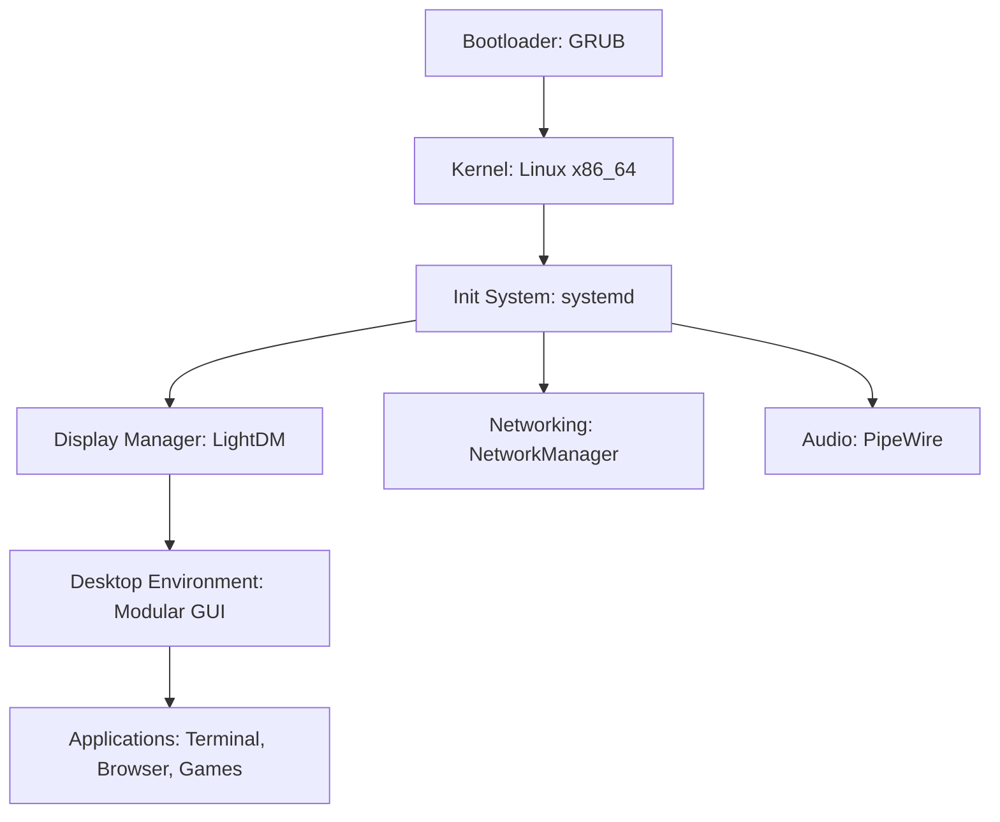

# Vayu OS


> **Vayu — Lightweight, modular, and invisible. Perfect for an embedded or minimal footprint scratch OS.**

Vayu is a high-performance, minimal footprint operating system designed for x86_64 architecture, optimized for VMware Workstation on ASUS hardware. It aims to be "invisible" while providing a robust base for embedded applications and minimal desktop environments.

## Features Matrix
- **Hypervisor Optimized:** Full integration with VMware Guest Tools for seamless interaction.
- **Low Footprint:** Stripped-down kernel and rootfs for maximum efficiency.
- **Modern Web Access:** Optimized Chromium/Firefox for low RAM usage.
- **Modular GUI:** Minimalist graphical environment (LXQt/XFCE) without bloat.
- **Entertainment:** Pre-installed lightweight games and WebGL portal access.

## Architecture
Vayu is built using a debootstrap-based process, targeting a minimal systemd-managed Linux environment.

### Diagram (Mermaid)


## How to Build
To build Vayu OS, you need a Linux environment with `xorriso`, `squashfs-tools`, and `grub-common`.

1. Clone the repository:
   ```bash
   git clone https://github.com/Attupatil/Vayu.git
   cd Vayu
   ```
2. Run the build script:
   ```bash
   make all
   ```
3. The output will be `Vayu-x86_64.iso`.

## Installation
Detailed installation instructions will be added to the `docs/` folder.

## License
Vayu OS is released under a custom license. It is free for educational and knowledge purposes. Corporate use is permitted for testing only; commercial use is prohibited without explicit permission. See [LICENSE](LICENSE) for details.
