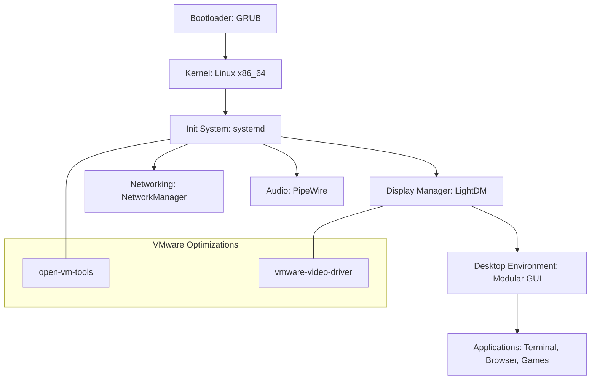

# Vayu OS Architecture

## System Overview
Vayu OS is a minimalist Linux distribution built from the ground up using the `debootstrap` tool. It is designed to be lightweight, modular, and optimized for VMware virtualization.

## Key Components
- **Kernel:** Modern Linux kernel (LTS) for stability and hardware support.
- **Init System:** `systemd` for efficient service management.
- **Display Server:** X11 with `xserver-xorg-video-vmware` for optimal hypervisor performance.
- **Desktop Environment:** LXQt or a stripped-down XFCE for a responsive GUI.
- **Network:** NetworkManager for seamless connectivity.
- **Audio:** PipeWire/WirePlumber for modern audio handling.

## Architectural Diagram

## Build Pipeline
The build process is automated via GitHub Actions:
1. **Bootstrap:** Uses `debootstrap` to create the root filesystem.
2. **Customization:** Installs packages, configures users, and sets up the desktop environment.
3. **Packaging:** Compresses the rootfs into a SquashFS image.
4. **ISO Generation:** Uses `grub-mkrescue` to create a bootable ISO.
